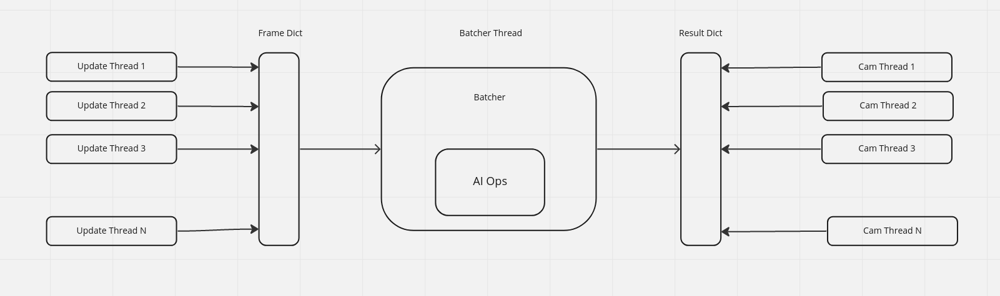
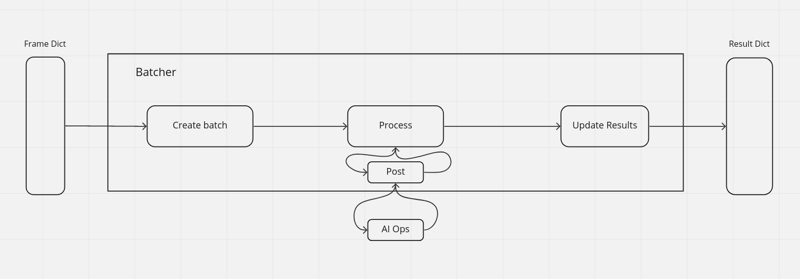
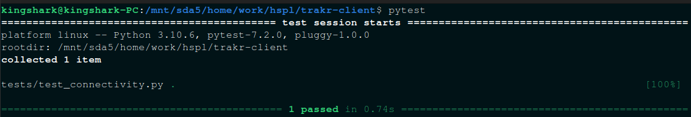

# Thread based trakr client


The repo for trakr-client using Python asyncio with OpenCV to grab frames 
from multiple video cameras concurrently and do ml-operations on them as fast as possible

#### Batcher as an Interface between camera threads and server.

#### Details of Batcher



## Running tests
Before initializing docker, make sure that all tests are passing. Ensure this by running the follwing command in your virtual enviornment.
```sh
 pytest
```
Output shall look like the following.


## Initiating docker on client side  

### To Build the docker
```sh
sudo docker-compose -f docker-compose.yaml up --build
```
### To run the docker container : 

Enter the image name you want to run from built docker images from the previous command
```sh
sudo docker run -it --gpus=all --net=host -v $(pwd)/sysconfig/:/app/sysconfig/ hacklabtest/trakr-client:version0.4.0 bash
```
--net=host                      : for running with redis
-v sysconfig/:/app/sysconfig    : for sharing the config file with server

### Once inside docker container
```python3.8
python3 main.py --cloud_config 1
```

--cloud_config : Boolean (1 or 0) 
  1 -> get the latest config from cloud
  0 -> Use the last saved config locally
                        
NOTE : 
Ensure the config on cloud has the same config version to that of locally saved config

TODO:
- :black_square_button: Implement face recognition system for trakr-client.
- :black_square_button: Test communication with cloud for face.
- :ballot_box_with_check: Add the size of frame config in sysconfig.json
- :ballot_box_with_check: Complete Batcher.
- :ballot_box_with_check: Update K-thread so update thread reads from the result dict, and empties the data after reading.
- :ballot_box_with_check: Update K-thread so operate thread puts data in the frame dict only when it is None.
- :ballot_box_with_check: Update batcher so it empties the data from frame dict, after reading it.
- :ballot_box_with_check: Create a method which only adds frames which have significant change from the last frame
- :ballot_box_with_check: Research correct delta values.

# Current Config

{
    "common": {
        "config_version": "1.0.1",
        "server_version": "1.0.0",
        "model_version": "1.0.0",
        "client_version": "1.0.0",
        "server_ip": "http://127.0.1.1:10230/",
        "train_storage_ip": "http://13.235.210.206:8090/api/testimage/TrainImageData/",
        "alert_storage_ip": "http://13.235.210.206:8090/api/testimage/AlertImageData/",
        "roi_ip": "https://dev.trakr.live/api/v1/9c8zso5R3uGu3zDWn2HP/telemetry",
        "roi_storage_ip": "https://dev.trakr.live/hapi/testimage/TrainImageData",
        "cloud_status_ip": "https://dev.trakr.live/api/v1/9c8zso5R3uGu3zDWn2HP/attributes",
        "workers": "1",
        "TestingLevel": 2,
        "ClientName": "TESTING",
        "CamNotReachableLimit": 5,
        "ServerNotReachableLimit": 5,
        "CamAliveLimit": 30,
        "LoggingLevel": "DEBUG",
        "LogFileSave": true,
        "Alert2Train": true,
        "enableFrame": true,
        "enableAlert": true,
        "frameFile": "DataFrame.png",
        "enableTraining": true,
        "enableSpeaker": true,
        "sav_vio_img": true,
        "save_all_detection": true,
        "save_all_inp_img": true,
        "CamDelay": 20,
        "test_url": "http://13.235.210.206:8080/api/v1/hf4tNLYMVpdCtg6B8YJk/telemetry",
        "alert_url": "http://13.235.210.206:8080/api/v1/A9nBr8X1X4Iehc4KSeFa/telemetry",
        "train_url": "http://13.235.210.206:8080/api/v1/6tqN6HLMttL0DlnwMT77/telemetry",
        "audio_key": {
            "nohelmet": "m:1",
            "novest": "m:2",
            "nomask": "m:3",
            "noshoe": "m:4"
        },
        "recommendations": {
            "nohelmet": "-> Please train workers to enter with proper \n safety helmet",
            "novest": "-> Please train workers to enter with proper \n safety vest",
            "nomask": "-> Please train workers to enter with proper \n mask",
            "noshoe": "-> Please train workers to enter with proper \n shoe",
            "nosafetyvest": "-> Please train workers to enter with proper \n safety vest",
            "car": "something",
            "person": "something",
            "bus": "something",
            "truck": "something",
            "social_distancing": "Please maintain social social_distancing"
        },
        "ROI_crop_en": 0,
        "ROI_en": 1,
        "batch_size": 2
    },
    "cameras": [
        {
            "CameraId": 78,
            "CamName": "cghj",
            "Address": "dfghj",
            "Detection": "fghjk",
            "train_en": "true",
            "alert_en": "true",
            "en_spkr": 1,
            "sav_vio_img": 1,
            "save_all_detection": 1,
            "save_all_inp_img": 1,
            "CamDelay": -6,
            "train_time_pause": -6,
            "alert_time_pause": 2,
            "ROI_crop_en": "3",
            "ROI": "NA",
            "Speaker": "Na"
        },
        {
            "CameraId": 12,
            "CamName": "gfd",
            "Address": "dfg",
            "Detection": "fg",
            "train_en": true,
            "alert_en": true,
            "en_spkr": 1,
            "sav_vio_img": 1,
            "save_all_detection": 1,
            "save_all_inp_img": 1,
            "CamDelay": -7,
            "train_time_pause": 4,
            "alert_time_pause": -4,
            "ROI_crop_en": -4,
            "ROI": "dggd",
            "Speaker": "dgfdg"
        }
    ],
    "sample_cameras": [
        {
            "CameraId": 0,
            "CamName": "cloudtestCam",
            "Address": "rtsp://172.17.0.1:8554/mystream1",
            "Detection": "person:car:social_distancing",
            "Speaker": "NA",
            "train_en": true,
            "alert_en": true,
            "en_spkr": 1,
            "sav_vio_img": 1,
            "save_all_detection": 1,
            "save_all_inp_img": 1,
            "CamDelay": 0.1,
            "train_time_pause": 10,
            "alert_time_pause": 10,
            "ROI_crop_en": 0,
            "ROI": "NA",
            "points": "NA",
            "sd_thresh_limit_x": 1000,
            "sd_thresh_limit_y": 1000,
            "roi_config": {
                "roi_config": {
                    "ROI1": {
                        "points": [
                            "0.08435952663421631,0.8030841026777102",
                            "0.012245232860247294,0.8417869850441262",
                            "0.014966527620951334,0.7244689847216194",
                            "0.06871208879682753,0.7014891542034385"
                        ],
                        "speaker_ip": "10.20.210.1",
                        "detections": "nosafetyvest:nosafetyharness:nohelmet"
                    },
                    "ROI2": {
                        "points": [
                            "0.42588194211324054,0.5890089906292197",
                            "0.31430888175964355,0.6047320424774547",
                            "0.3177105055914985,0.7063269909517265",
                            "0.4265622562832303,0.6930228810251495"
                        ],
                        "speaker_ip": "10.20.210.1",
                        "detections": "nohelmet:nosafetyvest:nosafetyharness"
                    },
                    "ROI3": {
                        "points": [
                            "0.23743232091267905,0.016932496318110713",
                            "0.16939996348487008,0.033864992636221426",
                            "0.18096546332041422,0.13304104039698472",
                            "0.2306290997399224,0.12336533157913773"
                        ],
                        "speaker_ip": "10.20.210.1",
                        "detections": "nosafetyvest:nohelmet:nosafetyharness"
                    },
                    "ROI4": {
                        "points": [
                            "0.5069307156694614,0.3453250371259445",
                            "0.6930693693969585,0.47550153681733826",
                            "0.5267326895506679,0.16271632852888057",
                            "0.7029703208932201,0.151868284191079",
                            "0.7029703208932201,0.15367628079330428"
                        ],
                        "detections": "nosafetyharness"
                    },
                    "ROI5": {
                        "points": [
                            "0.7910891365644962,0.4682694856839873",
                            "0.8702971029780052,0.4158373091405422",
                            "0.9386138738793917,0.4718855112506628",
                            "0.9415841805948751,0.6779983213066676",
                            "0.7851485231335293,0.6761903085233298"
                        ],
                        "detections": "social_distancing"
                    }
                }
            }
        },
        {
            "CameraId": 1,
            "CamName": "cloudtestCam",
            "Address": "rtsp://172.17.0.1:8554/mystream1",
            "Detection": "person:car:social_distancing",
            "Speaker": "NA",
            "train_en": true,
            "alert_en": true,
            "en_spkr": 1,
            "sav_vio_img": 1,
            "save_all_detection": 1,
            "save_all_inp_img": 1,
            "CamDelay": 0.1,
            "train_time_pause": 10,
            "alert_time_pause": 10,
            "ROI_crop_en": 0,
            "ROI": "NA",
            "points": [
                "1046,280",
                "796,191",
                "957,90",
                "1152,154"
            ],
            "sd_thresh_limit_x": 1000,
            "sd_thresh_limit_y": 1000,
            "roi_config": {
                "roi_config": {
                    "ROI1": {
                        "points": [
                            "0.08435952663421631,0.8030841026777102",
                            "0.012245232860247294,0.8417869850441262",
                            "0.014966527620951334,0.7244689847216194",
                            "0.06871208879682753,0.7014891542034385"
                        ],
                        "speaker_ip": "10.20.210.1",
                        "detections": "nosafetyvest:nosafetyharness:nohelmet"
                    },
                    "ROI2": {
                        "points": [
                            "0.42588194211324054,0.5890089906292197",
                            "0.31430888175964355,0.6047320424774547",
                            "0.3177105055914985,0.7063269909517265",
                            "0.42656225628323025,0.6930228810251495"
                        ],
                        "speaker_ip": "10.20.210.1",
                        "detections": "nohelmet:nosafetyvest:nosafetyharness"
                    },
                    "ROI3": {
                        "points": [
                            "0.23743232091267905,0.016932496318110713",
                            "0.16939996348487008,0.033864992636221426",
                            "0.18096546332041422,0.13304104039698472",
                            "0.2306290997399224,0.12336533157913773"
                        ],
                        "speaker_ip": "10.20.210.1",
                        "detections": "nosafetyvest:nohelmet:nosafetyharness"
                    }
                }
            }
        }
    ]
}